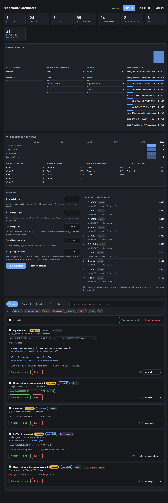

# 3Que Blocker

A Chrome (Manifest V3) extension that fetches a profile-ID blocklist from **your** server
and applies it on **Facebook** and **Threads**.

No Facebook/Threads SDK. No Graph API. It works by using the sites' own internal
JavaScript — the module registry, the Relay runtime, and the Relay store — from a
MAIN-world content script. See [`docs/RESEARCH.md`](docs/RESEARCH.md) for what that means
and why it was the right call.

---

## Two layers, plus reporting

**Layer 1 — Hide (on by default, zero risk).** Suppresses posts and comments
authored by listed profiles. Sends no requests and changes nothing on your
account. Takes effect the moment the list loads.

**Layer 2 — Real platform block (opt-in, off by default).** Performs genuine blocks
through the same internal request path the site's own Block button uses. Rate-limited,
queued, resumable, and shipped with dry-run enabled.

Layer 1 already removes the content from your experience. Layer 2 only matters if you
want the block to persist server-side and apply everywhere you're signed in.

**Reporting.** Users flag clone accounts from the page itself; an admin reviews
them and decides what reaches the blocklist. Nothing a user reports is blocked
automatically.

---

## Reporting a clone

**On Threads, every post gets a report button** in its action row, right after
Share:

```
♡ Like    💬 Reply    🔁 Repost    ➤ Share    ⚑ Report clone
```

Clicking it opens a confirmation showing exactly what will be sent — the
username, the numeric id, a summary of the post's content, and a link to the
post — so nobody reports something without seeing what it refers to. The same
detail travels with the report, because a reviewer deciding whether an account
is a clone needs the evidence, not just a name.

**Anywhere else**, hover a profile link — a post author, a commenter, a name in
a reply thread — and a small **Report** chip appears. The chip also shows what
is already known: *Reported ×3* if others have flagged the account, *Blocked* if
it is already on the list.

The popup has **Report this profile as a clone** for the profile you are viewing.

The whole widget lives in a Shadow DOM root. Facebook and Threads ship enormous
global stylesheets and rotate class names constantly; without that boundary the
widget would inherit their styles and could be caught by their own selectors.

It deliberately does **not** offer to report you to yourself, and ignores links
in site navigation — the sidebar "Profile" entry is a link to a profile, but it
is not someone you encountered in content.

## Moderation dashboard

Served by **your server**, at `http://<your server>/admin`. Sign in with the
username and password the server was started with — `admin` / `admin123` unless
you pass `--user` and `--pass`.



It is deliberately not in the extension. Shipping admin tooling inside a
distributed extension would put the admin credentials in every user's copy, and
moderating should not require the extension to be installed at all.

It gives you:

- **Stats** — pending / approved / rejected, total submissions, blocklist size,
  how many reports carry post evidence, a 14-day sparkline, and breakdowns by
  platform, by reason, and by reporter (which is what surfaces both your most
  useful reporters and anyone mass-reporting).
- **Queue** — tabs for pending, approved, rejected, all, plus the live
  blocklist. Free-text filter across name, @username, id and reason.
- **Evidence inline** — the posts people cited, with their text and links, shown
  in the row rather than hidden behind a detail view.
- **Bulk actions** — select several and approve or reject in one request.
- **Blocklist management** — see every entry with why it was added, and remove
  it.

Reports are grouped per account, not per submission: a second person reporting
the same profile raises its count rather than adding a row, so the queue shows
distinct accounts ranked by how many people flagged them. **Approve → block**
puts it on the list every installation polls; an approved entry offers **Remove
from blocklist** instead.

Taking an entry off the list — from the dashboard or the API — reopens its
report rather than leaving it marked approved, so the queue can never contradict
the list itself.

### Admin access

```
node server/server.js --user you --pass 'something long' [--trust-proxy]
```

Credentials come from `--user` / `--pass`, or `ADMIN_USER` / `ADMIN_PASS` in the
environment. They default to **`admin` / `admin123`** so a fresh checkout is
immediately usable.

The dashboard signs in by POSTing to `/admin/login`, which exchanges the
credentials for an **HttpOnly, `SameSite=Strict` session cookie** valid for 12
hours. Nothing readable by page scripts is stored in the browser, so a bug in the
dashboard cannot leak the password. `POST /admin/logout` invalidates the session
server-side, not just in the browser. Scripts and `curl` can skip the cookie and
send **HTTP Basic** on any admin route instead.

**While the defaults are in use, admin sign-in is refused from anywhere but
loopback.** So `node server/server.js` on your laptop stays convenient, while the
same command on a public host does not silently expose the review queue and
blocklist controls to the internet with a password printed in this README. Set
`--user` and `--pass` and the restriction lifts; `--allow-default-credentials`
overrides it deliberately, which you should not want.

The dashboard says so too — while the server is on defaults, the sign-in box
carries a warning telling you to change them before exposing it.

Comparisons are constant-time, and a wrong username costs exactly as much as a
wrong password.

### Report API

```
GET  /blocklist.json         the list extensions poll (ETag aware)
POST /reports                {platform, profileId|username, displayName, url, reason,
                              note, postUrl, postId, contentSummary,
                              reporter}   <- required: "facebook:<id>" | "threads:<id>"
                                             401 {error:"signed-out"} without it
GET  /reports/status?...     has this profile been reported or blocked?

POST /admin/login            {username, password} -> HttpOnly session cookie
POST /admin/logout           invalidates the session server-side
GET  /admin/session          who am I, and is this server on default creds?

GET  /admin/trends?days=14   the trending matrix: regions x days
GET  /admin/targets?region=   what a client in that region would be told to block
GET  /admin                  the moderation dashboard (the page itself is public)
GET  /admin/reports?status=  review queue                    (cookie or Basic)
POST /admin/reports/decide   {key|keys[], decision: approve|reject|revoke}
GET  /admin/blocklist        live list, annotated with why each entry is there
POST /admin/blocklist/remove {ids:[], usernames:[]}
GET  /admin/stats            counts, 14-day series, breakdowns, top reporters
```

Everything under `/admin/` except the page, `/admin/login` and `/admin/session`
requires authentication — session cookie or Basic:

```
curl -u you:yourpass http://localhost:8787/admin/stats
```

**Reporting is open and anonymous.** The whole point is that an ordinary user can
flag a clone without an account, a credential, or anything to configure; the gate
belongs at approval, not at intake. Pass `--submit-token` if you need to restrict
submission anyway.

## Too many clones for one account

A blocklist of a few thousand cannot be worked through by one account. The
platforms checkpoint an account that blocks at volume — which is the failure
this whole thing exists to avoid, arriving by a different road.

So the list is served as **two lists, because the two layers cost completely
different things.**

| | what it covers | cost | rationed? |
|---|---|---|---|
| **Layer 1** — hide in the DOM | everything on the list | nothing | no |
| **Layer 2** — real platform block | a ranked, budgeted slice | your account | yes, tightly |

Hiding a clone is free and carries no risk, so there is no reason to ration it.
A real block is what gets an account checkpointed, so it has to be spent on the
few clones that are active *now* and operating *where you are*.

### Warm and cold

Not all blocks look the same to the platform. Blocking someone whose profile is
on your screen is what an ordinary person does all day. Working through a list of
accounts you have never encountered is not, and it is the pattern that draws a
checkpoint.

So the queue tracks how each target got there:

- **warm** — resolved from the page you are looking at. Paced normally (4–11s),
  limited only by the overall hourly cap.
- **cold** — nominated by the server from the trending list, never seen in this
  browser. Paced slowly (20–45s) and held to a much tighter ceiling of its own
  (`maxColdBlocksPerHour`, default 4).

Warm is claimed first — it is both the safer and the more relevant signal, so the
two orderings agree far more often than they conflict. Reaching the cold ceiling
never stops warm work: rationing the ordinary case to protect against a risk it
does not carry would just make the extension feel broken.

**Seeing a cold target on screen promotes it to warm.** The same block is
unremarkable now and conspicuous later, so it is taken while it is cheap.

Set `maxColdBlocksPerHour` to **0** to never block anyone who has not appeared on
your screen.

### The trending matrix

Reports carry a coarse origin: the reporter's IANA time zone and language tag.
Both are things the browser already hands to every site it loads, and neither
needs an IP lookup, a geo database, or a third-party service. Turn it off with
**Send my time zone and language** in options.

The server keeps 14 daily buckets and a region tally per account, and ranks:

```
rank = trust × recency × (1 + velocity7d) × locality

  trust      trust-weighted report score (see "Who filed the report")
  recency    0.5 ^ (days since last report / 7)
  velocity   reports in the last 7 days
  locality   0.25 + 0.75 × how much of this clone's activity is in your region
```

Locality never zeroes a target out — a clone that is merely hot elsewhere stays
reachable, just lower. Everything is quantised to whole days on purpose: a
continuously-decaying score would change on every request, which would change the
ETag on every request, which would turn a cheap `304` into a full download every
time the extension polls.

The client asks for what its own rate limiter still has room for, so the slice
it gets back is one it can actually spend:

```
GET /blocklist.json?platform=threads&region=Asia/Ho_Chi_Minh&lang=vi-VN&budget=25

{
  "ids": [ ... ],          // everything, for hiding
  "usernames": [ ... ],
  "targets": [             // ranked slice, for actually blocking
    { "platform": "threads", "id": "...", "rank": 12.4,
      "why": { "trust": 2.4, "recentDays": 0, "velocity7d": 6,
               "region": 0.83, "lang": 0.83 } }
  ],
  "targetsAvailable": 812,
  "budget": 25
}
```

A client that sends no context still gets the plain list, unchanged.

The dashboard shows the matrix — regions down the side, days across, with what is
driving each region underneath. `GET /admin/trends` returns it as JSON, and
`GET /admin/targets?region=…` shows exactly what the server would tell a client
in that region to block, and why, so the ranking can be inspected before it is
trusted.

### Who filed the report

Reports carry the platform account behind them — `facebook:100000000000001`,
read from the page the extension is already running in. A report with no account
is refused with `signed-out`, and the sheet says so before you type rather than
after you submit.

**This is not verified, and it cannot be.** `fb_dtsg`, `lsd` and the session
cookies are opaque artifacts that only Meta can validate, and validating them
means Meta's API — excluded here by design. A patched extension can send any
number it likes. What the binding buys is *cost*: the previous scheme keyed the
reporter on a UUID the extension minted for itself, so clearing extension storage
produced a brand new reporter and one person could raise any report's count
without limit. Inflating a count now takes real accounts, and — more importantly
— it gives reputation something stable to attach to.

The raw account id never reaches the disk. A per-server HMAC turns it into a
stable pseudonym (`acct_0f8df7554dc15a7f`), which is everything reputation needs
— *is this the same person as last time* — while leaving the store useless to
anyone who copies it. A persistent bad actor is still bannable: you ban the
pseudonym. The salt lives in `server/.reporter-salt`; delete it and every
reporter becomes a stranger again.

### Reputation

Every decision teaches the server something. Approving a report credits everyone
who filed it; rejecting one debits them. A reporter's weight is
`(approved + 0.5) / (approved + rejected + 1)` — a Jeffreys prior, so an unknown
reporter sits at `0.50`, one bad call does not ruin a good history, and one lucky
call does not buy trust.

Reputation is **recomputed from the decided reports** on every read, never
accumulated. A running tally has to be un-done when a decision is revoked, and
every bug in that path is a reporter whose score is quietly wrong forever.
Revoking an approval takes its credit back automatically.

The queue is ranked by **trust-weighted score**, not raw count: ten reports from
accounts that have never been right about anything should not outrank two from
people who consistently are. A report whose every reporter sits below the trust
floor (`0.25`) is marked **held** and sinks to the bottom — still recorded, still
visible, just not able to jump the queue. Each row shows who stands behind it and
their record (`5✓ 0✗`).

### Rate limits

Three ceilings, all tunable, because the right value depends on who is behind the
address — a household NAT or a school shares one:

```
--report-rate N    reports per minute per address   (default 30)
--account-rate N   reports per minute per account   (default 10)
--login-rate N     sign-in attempts per 15 min      (default 10)
```

The per-account limit is the one that matters: one account behind a pool of
addresses is the shape mass-reporting actually takes.

### What this does not stop

Someone with several genuine Meta accounts, patient enough to build a record with
each, can still push a false report through. That is the honest ceiling of any
scheme that does not have Meta vouching for identities. What it costs them is
real accounts and real time, and the moment a decision goes against them, every
account involved loses weight — including on reports they filed earlier.

### Hardening

`/reports` is open to anyone, so everything reachable through it is bounded.

**Input limits.** Every caller-supplied field is clipped and stripped of control
characters: display name 80, note and content summary 400 each, reporter 64,
post id 64, username 64, profile id 32. Request bodies are capped at 64KB and
refused on the declared `Content-Length` before a byte is read. A profile id is
4–24 digits, so a megabyte of digits is not "a number". Per record, evidence
stops at 20 posts, notes at 50 and distinct reporters at 1000; the store stops
opening new files at 20,000 accounts.

**URLs are validated, not truncated.** Only `http:` and `https:` are stored —
anything else becomes `null`. The dashboard renders these as links the owner
clicks, and a `javascript:` href there would run in the dashboard's origin
carrying the admin session, which would let an anonymous reporter approve their
own report. An over-length URL is *rejected* rather than clipped, because
truncating a URL does not shorten it, it produces a different URL that still
parses and points somewhere else. The dashboard re-checks the scheme at the
point of use, so records predating the check cannot bite either.

**Report keys never touch a prototype.** The report map is created with
`Object.create(null)` and looked up with `hasOwnProperty`. On an ordinary
object, `reports['__proto__']` returns `Object.prototype` — truthy — and
`{"key":"__proto__","decision":"approve"}` would then write a status onto it.
The same applies to the stats tallies, which are keyed by reporter names.

**Rate limits.** 30 reports per minute per IP, 10 sign-in attempts per 15
minutes per IP. The sign-in throttle is not bypassable by then supplying the
correct password. Basic auth is a separate door and stays usable for scripts.

**Sessions.** HttpOnly, `SameSite=Strict`, `Secure` when the request arrived
over TLS, 12-hour expiry, capped at 200 with periodic sweeping.

**Headers.** `nosniff`, `X-Frame-Options: DENY` and `Referrer-Policy:
no-referrer` on everything. The dashboard adds a CSP with `default-src 'none'`,
`script-src 'self'`, `frame-ancestors 'none'` and no `unsafe-inline`, so a
payload that reaches the page as data still has no way to execute.

**CORS is scoped.** Only `/blocklist.json`, `/reports`, `/reports/status` and
`/health` answer cross-origin — the extension calls those from a facebook.com or
threads.com page. The entire admin surface advertises no cross-origin access, so
a hostile page cannot read a response even if one somehow arrived authenticated.

**Behind a proxy.** `isLoopback` decides whether the shipped default credentials
are accepted, and behind nginx every request genuinely arrives from `127.0.0.1`.
So a forwarding header is treated as proof the hop was *not* local, and the
defaults are refused. Pass `--trust-proxy` when the proxy is yours, and
`X-Forwarded-For` / `X-Forwarded-Proto` become the client address and scheme.

**Durability.** The blocklist and report store are written to a temporary file
and renamed over the target, so a crash mid-write cannot leave a truncated list.
Connections are bounded too: 30s request timeout, 20s headers timeout.

---

## Install

1. Open `chrome://extensions`, enable **Developer mode**.
2. **Load unpacked** → select this directory.
3. Open the extension's **Settings** and set your blocklist endpoint.
4. Click **Grant access** next to the URL — this requests host permission for that origin
   (required; Chrome will not let the extension fetch it otherwise).
5. Click **Test & refresh now**. You should see the parsed counts.

Requires Chrome 120+ (`"world": "MAIN"` needs 111; the 30-second `chrome.alarms` floor
and MV3 behaviour here assume 120).

## Publishing to the Chrome Web Store

Everything the listing needs is generated and reproducible:

```
npm run store-assets       # icons, promo tiles, marquee, screenshots -> store/
```

The icons are drawn from distance fields with no dependencies, so they stay
crisp at 16px instead of being a downscaled bitmap. The promo tiles and
screenshots are laid out in HTML and captured at their exact pixel size, and
the screenshots of the extension's own pages are genuine captures from a
browser with it loaded rather than mockups.

**[docs/CHROME-WEB-STORE.md](docs/CHROME-WEB-STORE.md)** has the rest: the
current requirements with sources, the listing copy ready to paste, permission
justifications, the data-collection disclosures, reviewer notes, a
pre-submission checklist — and an honest read on where this could be rejected,
including the parts that cannot be engineered away.

[PRIVACY.md](PRIVACY.md) is the privacy policy the store requires, and its
claims are checkable against the source: the only outbound requests in the
extension go to the two Meta origins and the endpoint you typed.

---

## Blocklist server contract

`GET <your endpoint>` returning JSON. Several shapes are accepted:

```jsonc
// simplest
["100001234567890", "100009876543210"]

// explicit
{ "ids": ["100001234567890"], "usernames": ["some.handle"] }

// records
{ "blocked": [ { "id": "100001234567890", "username": "some.handle" } ] }
```

A plain newline-delimited list of ids also works.

Optionally include `docIdOverrides` to hot-patch a Meta persisted-query rotation without
shipping a new extension build:

```jsonc
{
  "ids": ["100001234567890"],
  "docIdOverrides": { "ProfileCometActionBlockUserMutation": "6305880099497989" }
}
```

**`ETag` / `If-None-Match` is honoured** — return `304` for an unchanged list and refreshes
cost almost nothing. An optional `Authorization` header can be configured in settings.

### Reference server

A zero-dependency implementation is included, useful as both a test fixture and a spec:

```bash
node server/server.js --port 8787 --user you --pass 'something long'
# GET  /blocklist.json
# POST /blocklist.json   replace
# POST /add  |  /remove  {ids:[],usernames:[]}
```

It also carries the report queue and the moderation dashboard — see
[Admin access](#admin-access).

---

## Why IDs *and* usernames

Facebook rarely puts a numeric profile ID in the DOM — vanity URLs render as
`facebook.com/someone` with nothing else to key on.

The extension solves this by sweeping Meta's Relay store, which holds `id ↔ username`
pairs for everything on screen, and caching that mapping in `chrome.storage`. So a list
expressed purely in numeric IDs still matches a page that only shows usernames, and vice
versa. The mapping improves the more you browse.

Numeric IDs are still the better key: they survive a username change.

---

## Authorship, not mentions

A blocked profile appearing *inside* someone else's post — a comment, a tag, a
"X shared this" — does not take that post down. Only what they actually wrote is
hidden: their own posts, and their own comments wherever those appear.

This matters more than it sounds. Harvesting every link in a story is the easy
implementation, and it makes a blocker feel broken: one blocked person commenting
on a friend's photo would erase the friend's photo. Author extraction is scoped to
the byline (headings/`<strong>` next to the avatar) and excludes anything inside a
nested comment subtree, on both the DOM and Relay paths.

---

## Architecture

```
     your server
          │  (fetch: service worker only — page CSP blocks it anywhere else)
          ▼
┌─────────────────────┐
│   service worker    │  blocklist cache · ETag · alarms
│                     │  block queue · leases · rate limiter
└──────────┬──────────┘
           │ chrome.runtime
┌──────────▼──────────┐
│  ISOLATED content   │  chrome.* APIs · DOM suppression · id index
│    scripts          │
└──────────┬──────────┘
           │ window.postMessage  (worlds cannot share objects)
┌──────────▼──────────┐
│  MAIN world script  │  __d hook · require() · Relay env + store
│  (document_start)   │  React fibers · commitMutation · request capture
└─────────────────────┘
```

The split is forced by the platform: MAIN-world scripts get **no `chrome.*` APIs**, and
isolated-world scripts cannot see the page's `require`, its Relay store, or React's
expando properties on DOM nodes.

| File | Role |
|---|---|
| `src/main/inject.js` | Module-registry hook, tokens, Relay, block strategies, request capture |
| `src/content/bridge.js` | MAIN ↔ ISOLATED ↔ service-worker messaging |
| `src/content/identity.js` | Blocklist index, id↔username alias cache |
| `src/content/dom-blocker.js` | Selector engine + MutationObserver |
| `src/content/main.js` | Orchestration, Relay store sweep, block worker |
| `src/background/service-worker.js` | Server fetch, queue, rate limiter, alarms |

---

## If it says "block mutation not found"

That is expected, not a failure. Meta ships the block module lazily — it genuinely is not
in the page until something needs it, and neither `Bootloader.loadModules` nor
`requireLazy` can pull it by name (both time out; the loader needs a resource map that
only ships when a component needing it renders).

**Open any profile's "..." menu once.** That loads the module, after which
`require('useTHUserBlockMutation.graphql')` resolves and the extension can drive the
site's own Relay code for the rest of that page load.

The extension also watches `fetch` and `XMLHttpRequest` and captures a real block request
if it sees one — including the generated Relay provider variables that cannot be
reconstructed by hand. That capture is only used when raw fallback is explicitly enabled;
it excludes the extension's own requests, so it cannot learn from its own failures.

---

## Testing

```bash
node tools/check.js         # static: syntax, manifest refs, MV3 CSP
node tools/queue-test.js    # Layer 2 queue + rate limiter (mocked chrome.*)
node tools/server-test.js   # report lifecycle + admin auth over real HTTP
node tools/report-test.js   # in-page report UI, browser, against live Threads
node tools/e2e-test.js      # hiding + Relay discovery, browser
npm test                    # all of the above
```

`server-test.js` runs the real server against a throwaway store and drives it
over HTTP: the report lifecycle end to end, non-ASCII names surviving the round
trip, ETag revalidation, the hardening above -- field truncation, oversized
bodies refused, `javascript:` URLs dropped while the post's text is kept, a
`__proto__` report key treated as missing with `Object.prototype` left
untouched, CORS scoped away from `/admin`, the CSP served, sign-in throttled and
not bypassable with the right password, and default credentials refused to a
caller a forwarding header says is remote -- and the admin gate — wrong password, wrong username,
cookie login, sign-out actually invalidating the session server-side, reporting
succeeding with no credentials while the same anonymous caller is refused at
`/admin`, and default credentials working from loopback. 31/31.

`queue-test.js` drives the real service-worker message handler against a mocked
`chrome.*`, covering the Layer 2 queue, leases and rate limiter — logic the
browser test deliberately never exercises, because it must never block anyone for
real. It verifies that a failing target backs off instead of starving the queue,
that failed *attempts* (not just successes) count toward the caps, that dry runs
rotate without consuming the limit, and that two tabs cannot claim the same
target. 12/12.

Loads the extension into real Chrome and exercises it against live `threads.com` and
`facebook.com`: manifest load, service-worker boot, server fetch, bridge handshake, module
hook, Relay discovery, and that content from a listed profile is genuinely hidden. It
asserts that **no real block is attempted**.

Current status — **24/24 browser · 23/23 queue · 88/88 server · 11/11 report · static clean**:

```
PASS  extension service worker started
PASS  blocklist fetched + parsed by service worker      — 1 ids, 1 usernames
PASS  MAIN world hooked Meta module registry            — 4869 modules, 578 graphql
PASS  live Relay environment discovered                 — BarcelonaRelayEnvironment, 593 records
PASS  Relay commitMutation available
PASS  MAIN world request/response round-trip resolves   — 1ms
PASS  content from blocklisted profile is hidden        — 20 hidden, 0 visible
PASS  judged by authorship, not by being mentioned      — mention post stays visible
PASS  the blocked profile's own nested comment is hidden
PASS  placeholder hide mode applies after settings change — 20 placeholders
PASS  disabling hiding restores all content              — 0 hidden, 0 leftover
PASS  no real block was attempted (safety)
PASS  facebook: MAIN world hooked module registry       — 2728 modules, 33 graphql
PASS  facebook: Relay environment reachable             — CometRelayEnvironment
```

Note: current Chrome builds ignore the `--load-extension` switch, so the harness loads the
extension over CDP (`Extensions.loadUnpacked`). Loading unpacked via `chrome://extensions`
in normal use is unaffected.

---

## Verified against a live signed-in account

Layer 2 was tested end to end on a real Threads account:

- **Blocking works** via `RelayModern.commitMutation` driven with Threads' own
  operation node (`useTHUserBlockMutation`, `POST /api/graphql`). The block took
  effect and the session survived.
- **Raw request fallbacks are off by default and should stay off.** Hand-built
  CSRF-bearing POSTs to the Instagram REST paths 404 on threads.com *and*
  coincided with Meta invalidating the signed-in session, twice. Driving the
  site's own code never did. See [`docs/RESEARCH.md`](docs/RESEARCH.md).
- **One constraint:** the block module is lazily loaded, so it is only reachable
  after the block UI has been opened once in that page load. `Bootloader` and
  `requireLazy` cannot force it.

---

## Limitations and honest caveats

- **Facebook Layer 2 is verified too.** `ProfileCometActionBlockUserMutation` via
  `POST /api/graphql/`, driven through `commitMutation`. The block appeared in
  Facebook's own Settings -> Blocking list and was reversed from there. On
  Facebook the module loads only once the block **confirmation dialog** is
  raised -- opening the overflow menu is not enough.
- **Blocking on Facebook has an irreversible side effect.** It consumes a
  pending friend request, and unfriends an existing friend. Unblocking restores
  neither.
- **Layer 2 needs the block module primed.** Until the site has loaded it, the
  extension reports that plainly and does nothing rather than firing a request.
- **Rate limits are guesses.** No public source documents Meta's block thresholds. The
  defaults are deliberately conservative. Bulk-mutating an account can trigger a
  verification checkpoint — the extension detects that, halts, and disables Layer 2.
- **Selectors will drift.** Comet and Barcelona generate obfuscated, rotating class names.
  This code keys only on semantic attributes (`role`, `aria-*`, `data-pagelet`,
  `data-pressable-container`), which are far more stable, but nothing here is guaranteed
  against a redesign.
- **Layer 2 mutates your account.** Blocks are not silently reversible in bulk. Keep dry
  run on until you have watched it resolve a real strategy.
- Automating interactions may be inconsistent with the platforms' terms of service. That
  judgement is yours to make.

---

## Layout

```
manifest.json
src/  main/ content/ background/ popup/ options/ common/ ui/
server/server.js          reference blocklist server
tools/e2e-test.js         end-to-end browser test
tools/make-icons.js       dependency-free PNG generation
tools/make-store-assets.js  listing tiles and screenshots, at exact sizes
docs/RESEARCH.md          internals findings, with what is and isn't verified
docs/CHROME-WEB-STORE.md  store requirements, listing copy, rejection risks
store/                    generated listing assets
PRIVACY.md                privacy policy (required by the store)
```
